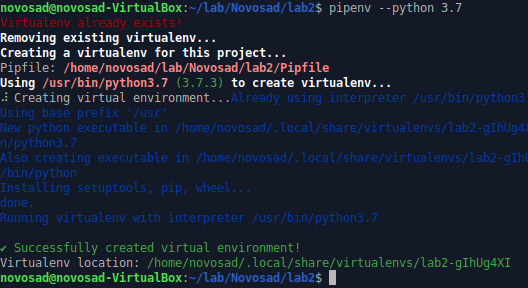
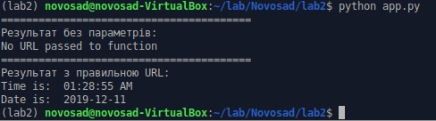
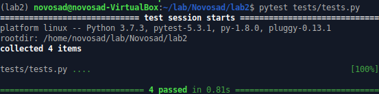
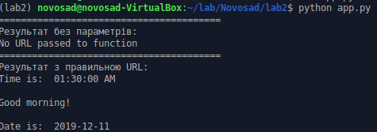
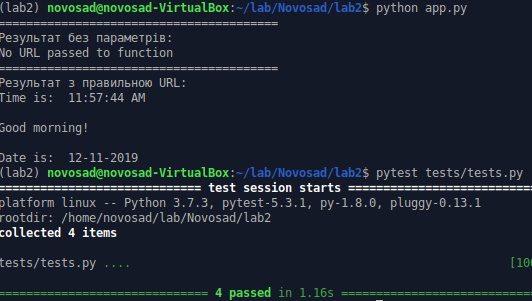
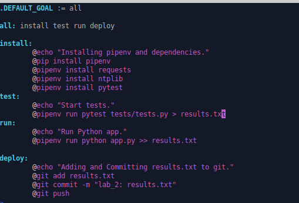

1. Створив папку з лабораторною. Створив REadme.md.
2. Інсталював `pipenv` та створив середовище:

3. Встановив бібліотеку `requests` та `ntplib`.
4. Створив файл `app.py`. Скопіював код з репозиторію. Ознайомився з Python tutorial.
5. Переконався що програма працює:

6. Встановив `pytest`. Ознайомився з документацією.
7. Запустив тести:

8. Дописав функцію що перевіряє час доби та виводить привітання:

9. Написав тест для перевірки правлильності виконання функції:

10. Перенаправив вивід у файл операторами `>` та `>>`.
12. Заповнив Makefile:
