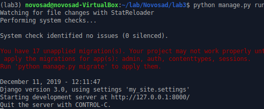

1. Створив папку з лабораторною. Ініціалізував середоивище та інсталював django
2. Створив заготовку Django (my_site). Виніс файли на рівень вище.
3. Запустив додаток:

4. Виключив файл `db.sqlite3` з коміту шляхом додавання `.gitignore`
5. Створив заготовку додатку. Дав назву `main`.
6. Створив папку `main/templates`, додав туди файл `main.html`. Створив файл `main/urls.py`.
7. Додав додаток в налаштування `my_site/settings.py` у змінну `INSTALLED_APPS`, та вніс зміни у `main/urls.py`.
8. Створив `main/views.py`
9. Заповнив файл `main/urls.py`.
10. Запустив сервер.
11. Встановив бібліотеку `requests` та додав файл `monitoring.py`
12. Відкрив сторінку `health
13. 
- Модифікував функцію `health`.
- Дописав функціонал для виведення повідомлення про недоступність сайту
- зробив щоб програма працювала у бекграунді
- додав швидкий виклик для моніторингу `pipenv run monitoring`
14. Зробив коміт `server.logs`
