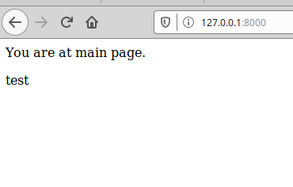

# Lab_4: Робота з Docker
1. Звернувся до документації
2. Запустив тестові команди та перенаправив вивід команд у файл `my_work.log`
3. Ознайомився з документацією
4. Створив файл `Dockerfile` та скопіював вміст. Замінив посилання та шляхи на власні.
5. Створив власний репозиторій на Docker Hub.
6. Виконав білд та запушив імедж на dockerhub. [ПОСИЛАННЯ](https://hub.docker.com/r/olegnov1203/devops)
7. Запустив веб-сайт та переконався що все працює:

8. Створюю ще один файл `Dockerfile.monitoring`:
- створив ще один файл для програми моніторингу.
- виконав білд
- запустив два контейнери одночасно.
- витягнув `server.log` та зробив коміт.