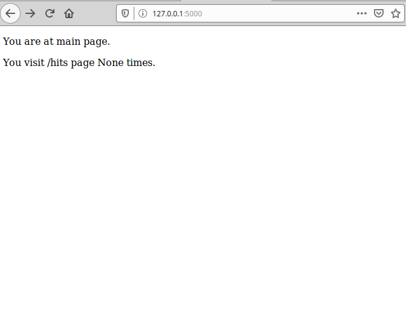
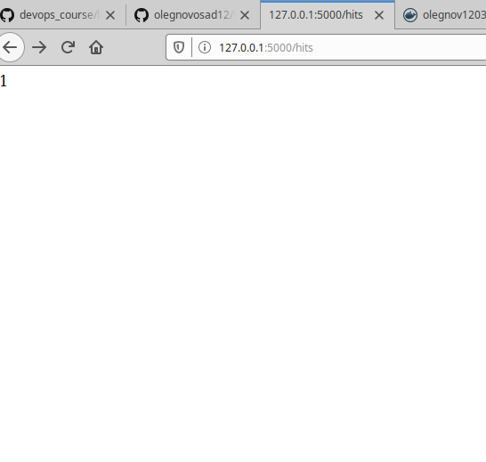
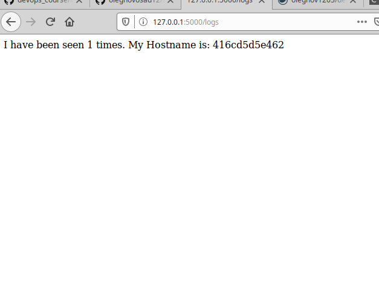

# Lab_5: Автоматизація за допомогою Makefile VS Docker Compose
1. Прочитав про docker-compose.
2. Прочитав про flask
3. good.
4. let's go.
5. Створив папку `my_app`. Створив папку `tests`. Скопіював файли з репозиторію.
6. Ініціалізував середовище для серверу та тестів. Видалив файли що були створені середовищем.
7. Створив `Makefile` та два `Dockerfile`.
8. Директиви Makefile:
- STATES - змінна містить назви цілей.
- REPO - назва репозиторію.
- .PHONY - вказує фіктивні цілі
- $(STATES): - ціль для створення контейнерів tests та app
- run - запуск контейнерів сервера та мереж
- test-app - запуск контейнера з тестами
- docker-prune - очищення ресурсів.
9. Створив імеджі з допомогою `make`. Замінив репозиторій на свій та запустив обидва контейнери. Скріни:

10. Зупинив та почистив ресурси.
11. Створив директиву для завантаження імеджів.
12. Видалив створені та закачані імеджі. Створив директиву для видалення імеджів.
13. Створив файл `docker-compose.yml`. Мережі використовуються різними контейнерами для конкретних цілей, таким чином ізолюється небажаний доступ до цих мереж.
14. Запустив docker-compose.
15. Сайт працює. Адреса на яку треба перейти : `127.0.0.1`
16. Докер створив імеджі з вашим репозиторієм. Замінив їх на власні.
17. Зупинив проект. Почистив ресурси
18. Завантажив імеджі до свого репозиторію.
19. В залежності від ситуації: якщо треба працювати тільки з докером, то docker-compose - найкращий варіант, для інших цілей краще використовувати Make
20. Створив `docker-compose.yml` для попередньої лаб. роботи та помістив у папку з нею.